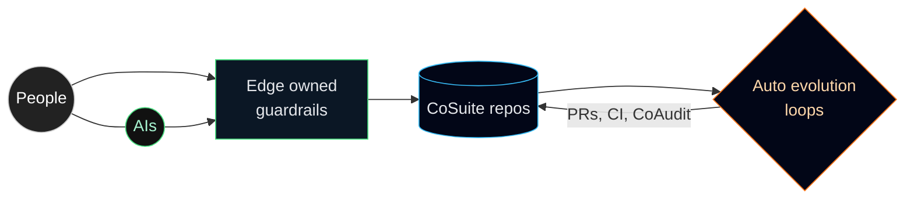
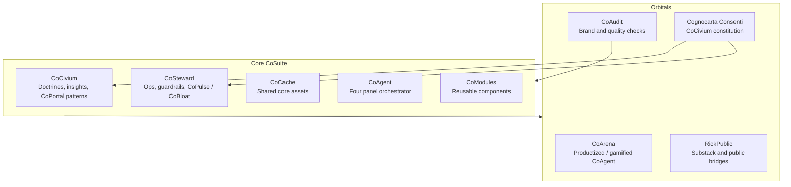

# CoSuite profile diagrams (scratchpad)

These diagrams are parked here so experiments do not break the GitHub profile README.

```mermaid
flowchart LR
    People((People)):::human --- AIs((AIs)):::ai
    People & AIs --> Guardrails[Edge owned\nguardrails]:::guard
    Guardrails --> CoSuite[(CoSuite repos)]:::core
    CoSuite --> AutoEvo{Auto evolution\nloops}:::auto
    AutoEvo -->|PRs, CI, CoAudit| CoSuite

    classDef human fill:#222222,stroke:#cccccc,color:#ffffff;
    classDef ai fill:#111111,stroke:#4ade80,color:#a7f3d0;
    classDef guard fill:#0b1725,stroke:#4ade80,color:#e5e7eb;
    classDef core fill:#020617,stroke:#38bdf8,color:#e5e7eb;
    classDef auto fill:#020617,stroke:#f97316,color:#fed7aa;
```

```mermaid
flowchart TB
    subgraph Core["Core CoSuite"]
        CoCivium["CoCivium\nDoctrines, insights, CoPortal patterns"]
        CoSteward["CoSteward\nOps, guardrails, CoPulse / CoBloat"]
        CoCache["CoCache\nShared core assets"]
        CoAgent["CoAgent\nFour panel orchestrator"]
        CoModules["CoModules\nReusable components"]
    end

    subgraph Orbitals["Orbitals"]
        CoArena["CoArena\nProductized / gamified CoAgent"]
        CoAudit["CoAudit\nBrand and quality checks"]
        Cognocarta["Cognocarta Consenti\nCoCivium constitution"]
        RickPublic["RickPublic\nSubstack and public bridges"]
    end

    Core --> Orbitals
    CoAudit --> Core
    Cognocarta --> CoSteward
    Cognocarta --> CoCivium
```
